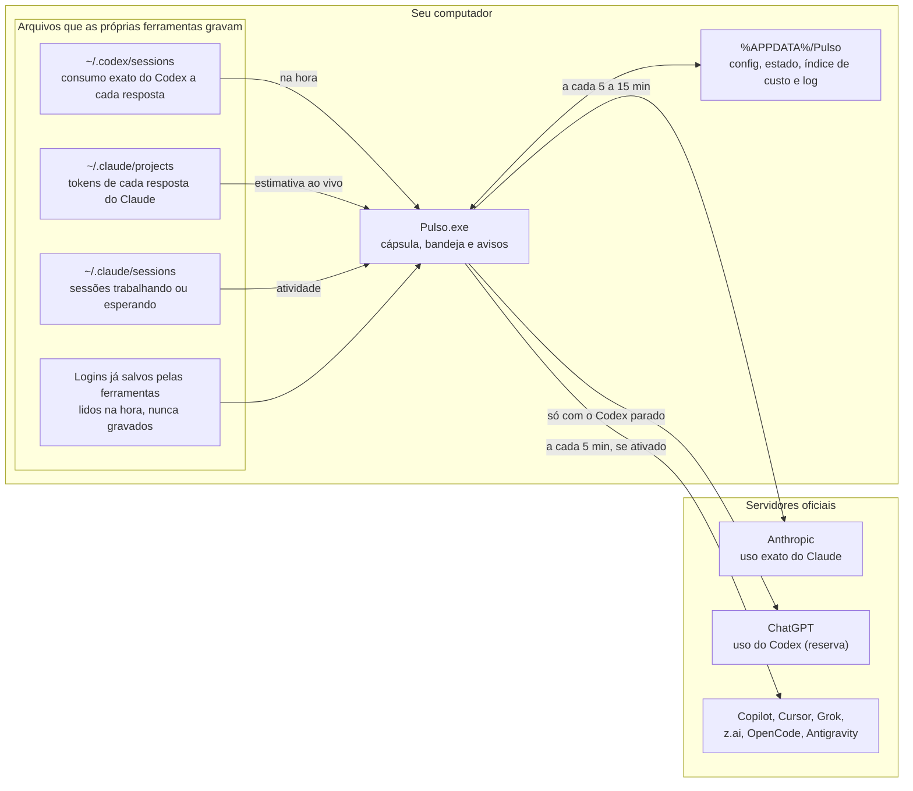

<div align="center">


<h1>Pulso</h1>

<p>
  <strong>O consumo do Claude Code e do Codex ao vivo, numa cápsula na borda da tela do Windows.</strong>
</p>

<p>
  App nativo para Windows que mostra, em anéis sempre à vista, quanto já foi usado de cada limite (sessão de 5 horas, semana, semana por modelo) e quando ele renova. A leitura do Codex chega no instante em que a resposta termina, direto dos arquivos de sessão; a do Claude combina a leitura exata do servidor com uma estimativa local que se move a cada resposta. Leve, sem navegador embutido e sem gravar nenhuma credencial.
</p>

<br/>

<p>
  <a href="https://learn.microsoft.com/dotnet/csharp/"></a>
  
  <a href="https://dotnet.microsoft.com/download/dotnet-framework/net48"></a>
  
  <a href="https://learn.microsoft.com/windows/win32/"></a>
</p>

<br/>

<p>
  
  
  
</p>

<br/>

<a href="https://github.com/LucasDias777/Pulso/releases/latest/download/Pulso.exe"></a>

<br/><br/>

<table>
  <tr>
    <td align="center"></td>
    <td align="center"></td>
  </tr>
  <tr>
    <td align="center"><sub>Cursor sobre o anel do Claude</sub></td>
    <td align="center"><sub>Cursor sobre o anel do Codex</sub></td>
  </tr>
</table>

</div>

---

## Sumário

- [O que o Pulso faz](#o-que-o-pulso-faz)
- [Provedores suportados](#provedores-suportados)
- [Como a leitura funciona](#como-a-leitura-funciona)
  - [Com que frequência cada leitura acontece](#com-que-frequência-cada-leitura-acontece)
- [Tecnologias](#tecnologias)
- [Privacidade e segurança](#privacidade-e-segurança)
- [Leveza](#leveza)
- [Estrutura do projeto](#estrutura-do-projeto)
- [Instalação](#instalação)
- [Atualização](#atualização)
- [Desinstalação](#desinstalação)
- [Como usar](#como-usar)
- [Configurações](#configurações)
- [Desenvolvimento](#desenvolvimento)
- [Diagnóstico e linha de comando](#diagnóstico-e-linha-de-comando)

## O que o Pulso faz

| Recurso | Como funciona |
|---|---|
| **Anéis ao vivo** | Um anel por provedor, encostado na borda da tela, com o percentual do limite principal. A cor passa de verde para amarelo e vermelho nos limites que você escolher. Um `~` antes do número indica que ele já inclui a estimativa local |
| **Cartão ao passar o cursor** | Cada limite com barra, percentual usado, horário de renovação, folga ou excesso em relação ao ritmo, velocidade e projeção de esgotar antes de renovar |
| **Projetos e sessões** | Quanto da sessão de 5 horas veio de cada pasta de projeto e quais sessões estão trabalhando ou esperando você; clicar numa sessão traz a janela dela para a frente |
| **Indicador de atividade** | Dentro do anel: arco girando enquanto o agente trabalha, círculo pulsando quando ele para e espera a sua resposta |
| **Avisos** | Cartão ao lado do anel, com som, quando um limite renova, chega a 80%, 95% e 100%, quando o ritmo vai esgotar a sessão antes de renovar e quando uma sessão termina ou espera você |
| **Exibição** | Sempre aberta, recolhida numa cápsula pequena que abre ao passar o cursor, ou oculta, só com o ícone da bandeja. Em qualquer borda e monitor, e some sozinha em tela cheia |
| **Atalho global** | `Win + Y` mostra e oculta a cápsula de qualquer lugar; dá para gravar outra combinação |
| **Três idiomas** | Português, inglês e espanhol; a troca vale na hora |
| **Instala como um app** | Menu Iniciar, Aplicativos do Windows com Desinstalar, início com o Windows e atualização pelo próprio app |

<div align="center">
  
  <br/>
  <sub>A cápsula em repouso: um anel por provedor, com os arcos nas duas orelhas</sub>
</div>

## Provedores suportados

Claude e Codex vêm ligados. Os outros aparecem na aba **Contas** e só ganham anel quando você os ativa; um provedor que não está instalado no computador não ocupa espaço na cápsula.

| Provedor | De onde vem o número |
|---|---|
| **Claude Code** | Leitura exata do servidor da Anthropic (`/api/oauth/usage`) com o login que o Claude Code já mantém, mais a estimativa ao vivo calculada pelos tokens de cada resposta gravada em `~/.claude/projects` |
| **Codex** | Os arquivos de sessão do próprio Codex (`~/.codex/sessions`), que trazem o consumo exato a cada resposta. O servidor do ChatGPT só é consultado quando o Codex fica parado |
| **GitHub Copilot** | API do GitHub com o login do `gh` (ou `GH_TOKEN`): pedidos premium do mês |
| **Cursor** | Banco local do Cursor (SQLite) para o login e a API de uso do Cursor |
| **Grok** | Login salvo em `~/.grok` e a API de cobrança do Grok |
| **z.ai (GLM)** | Chave da API e o endpoint de cota da z.ai |
| **OpenCode** | Login do OpenCode e a API de uso do opencode.ai |
| **Antigravity** | Servidor local do Antigravity quando ele está aberto, ou o login guardado no Gerenciador de Credenciais do Windows; sem cota publicada, mostra a contagem de pedidos do dia |

## Como a leitura funciona



**A estimativa do Claude.** O servidor da Anthropic aceita poucas consultas (responde `429` se consultado demais). Para o anel não ficar parado entre uma leitura e outra, o Pulso mantém um índice do custo de cada minuto de uso, montado a partir dos tokens gravados nas sessões. Com uma única leitura exata ele calcula quanto cada dólar de uso representa da janela (`% da janela ÷ custo desde o início da janela`) e, a partir daí, soma o custo das respostas novas. O número estimado aparece com `~` e é corrigido a cada leitura exata.

### Com que frequência cada leitura acontece

| Fonte | Quando |
|---|---|
| Codex (arquivos de sessão) | Na hora: 0,1 a 0,2 s depois de a resposta ser gravada |
| Codex (servidor) | Só quando o Codex fica mais de 5 minutos parado |
| Claude, leitura exata | A cada 5 min em uso e 15 min parado, nunca menos de 2 min entre consultas; clicar no anel pede uma leitura nova |
| Claude, estimativa e atividade | A cada resposta gravada, e na hora em que uma sessão muda de estado (sem hooks) |
| Outros provedores | A cada 5 min, só se o provedor estiver ativado |

## Tecnologias

O Pulso não usa nenhum pacote externo: tudo vem do próprio Windows e do .NET Framework.

| Tecnologia | Função no projeto |
|---|---|
| **C# 5 e .NET Framework 4.8** | Linguagem e runtime, já presentes no Windows 10 1903+ e no 11; compilado pelo `csc.exe` do próprio .NET |
| **Windows Forms e GDI+** | Janelas, bandeja, menus e o desenho da cápsula, dos anéis e dos cartões |
| **DirectWrite** | Todo o texto, nítido em qualquer tamanho e monitor e igual no Windows 10 e no 11 |
| **Win32** | Janela transparente por pixel, atalho global, detecção de tela cheia e DPI por monitor |
| **winsqlite3.dll e WMI** | SQLite nativo do Windows (Cursor e OpenCode) e localização do servidor do Antigravity |

## Privacidade e segurança

| Ponto | Como o Pulso trata |
|---|---|
| **Credenciais** | Lê só os logins que cada ferramenta já mantém no seu usuário, em memória e na hora da consulta. Nada é gravado, copiado ou enviado para outro lugar além do servidor oficial de cada uma |
| **Token vencido** | Um token do Claude vencido nunca é enviado; o Pulso espera o Claude Code renová-lo |
| **O que fica salvo** | Só `%APPDATA%\Pulso`: suas escolhas, as últimas leituras, o uso por minuto e por projeto e o log. Nenhuma credencial |
| **Atualização** | Usa o próprio Git do computador e o login que ele já tem; o Pulso não guarda senha nem token do GitHub |
| **Barra de status (opcional)** | Ligada só nas Configurações: grava uma linha no `~/.claude/settings.json`, com backup, e desligar remove a linha. Fora isso, nada é instalado no Claude Code |
| **Cápsula adaptável** | Lê o brilho médio de uma faixa fina da tela ao lado da cápsula; nada da imagem é guardado |

## Leveza

Medido com o Pulso aberto, o Claude trabalhando e o indicador de atividade animando:

| | Pulso |
|---|---|
| Memória em uso | ~68 MB (44 MB próprios) |
| CPU | ~0,2% |
| Programa no disco | 296 KB |
| Dados salvos | ~0,1 MB |

A cápsula só redesenha quando algo muda: 60 quadros por segundo durante a animação de abrir, 10 por segundo com um agente trabalhando e nenhum quando está tudo parado.

## Estrutura do projeto

```bash
Pulso/
├── src/
│   ├── App.cs          # Ponto de entrada: instância única, liga leituras, cápsula, bandeja e avisos
│   ├── Core/           # Configurações, modelo, ritmo, avisos, idiomas, instalação, atualização e integrações
│   ├── Sources/        # De onde vêm os números: Claude, Codex e os outros provedores
│   └── Ui/             # O que aparece na tela: cápsula, cartões, Configurações, bandeja e texto
├── assets/pulso.ico    # Ícone do app (gerado por tools/gerar-icone.ps1)
├── docs/imagens/       # Imagens deste README
├── app.manifest        # DPI por monitor e controles visuais do Windows
├── build.cmd           # Compila o bin\Pulso.exe
├── instalar.cmd        # Compila e instala (ou reinstala por cima)
└── atualizar.cmd       # Baixa a versão nova do GitHub e reinstala
```

## Instalação

O Pulso roda em qualquer computador com **Windows 10 ou 11** e se instala como um app comum, só para o seu usuário, sem permissão de administrador. Cada computador mantém as próprias configurações em `%APPDATA%\Pulso`.

### Pelo download

1. Clique em **[Baixar o Pulso](https://github.com/LucasDias777/Pulso/releases/latest/download/Pulso.exe)** e abra o `Pulso.exe` baixado.
2. Se o Windows avisar que protegeu o computador (o Pulso não tem assinatura digital), clique em **Mais informações** › **Executar assim mesmo**.
3. Confirme **Instalar o Pulso neste computador?**: ele se copia para a pasta de programas do usuário, entra no Menu Iniciar e em Aplicativos do Windows e abre.

O exe vem das Releases deste repositório, que é privado: o botão só baixa com a conta do GitHub logada no navegador.

### Pelo projeto (desenvolvimento)

Compila no próprio computador e atualiza pelo Git.

#### Pré-requisitos

| Item | Versão | Obrigatório? | Download oficial | Observação |
|---|---:|---|---|---|
| **Windows** | `10 (1903+)` ou `11` | Sim | — | Usa recursos do próprio Windows (janela transparente, bandeja, atalho global) |
| **.NET Framework** | `4.8` | Sim | [Baixar .NET Framework 4.8](https://dotnet.microsoft.com/pt-br/download/dotnet-framework/net48) | Já vem no Windows 10 1903+ e no 11, com o compilador que o `build.cmd` usa |
| **Git** | Atual | Sim | [Baixar Git](https://git-scm.com/downloads) | Para baixar o projeto e receber as atualizações |
| **Claude Code** e/ou **Codex** | Atual | Para ter leituras | [Claude Code](https://claude.com/claude-code) · [Codex](https://developers.openai.com/codex) | Instalados e logados nesse computador: o Pulso lê o que eles gravam |

#### Passo a passo

```bat
:: Baixar o projeto (é privado: entre na sua conta do GitHub quando o Git pedir)
git clone https://github.com/LucasDias777/Pulso.git

:: Instalar: compila, instala e já abre o Pulso
Pulso\instalar.cmd
```

Também dá para dar dois cliques no `instalar.cmd`. Rodá-lo de novo reinstala por cima, mantendo as configurações.

> **Computador com outra conta do GitHub** (como o da empresa): clone com o usuário no endereço, `https://LucasDias777@github.com/LucasDias777/Pulso.git`, para o Git guardar o login pessoal separado.

> **Mantenha a pasta clonada**: é dela que saem as atualizações. O Pulso instalado fica em outra pasta.

## Atualização

- **Instalado pelo projeto**: o Pulso procura versão nova sozinho, 2 minutos depois de abrir e a cada 12 horas. Quando há uma, aparecem **Instalar atualização** em Configurações › Geral e **Atualizar o Pulso (versão nova)** na bandeja: ele baixa, compila e reabre o Pulso em alguns segundos, mantendo as configurações. Na primeira vez em cada computador, clique em **Procurar atualização** para o Git pedir o login do GitHub uma vez; a procura automática nunca abre janela.
- **Instalado pelo download**: baixe de novo pelo botão **Baixar o Pulso** e abra o `Pulso.exe`; ele pergunta se atualiza o Pulso instalado e mantém as configurações.

## Desinstalação

Por Configurações › Aplicativos do Windows, como qualquer app, ou pelo botão **Desinstalar…** em Configurações › Geral. O desinstalador fecha o Pulso, remove o atalho, a entrada em Aplicativos, o início com o Windows e a barra de status do Claude Code (se estava ligada), e pergunta se apaga também as configurações e o histórico. A pasta clonada do projeto não é tocada.

## Como usar

| Ação | Resultado |
|---|---|
| Passar o cursor num anel | Abre o cartão daquele provedor |
| Clicar num anel | Pede uma leitura nova (no Claude, respeitando o intervalo mínimo de 2 min) |
| Clicar numa sessão no cartão | Traz a janela daquela sessão para a frente |
| Passar o cursor na orelha de baixo e clicar na engrenagem | Abre as Configurações |
| Arrastar os pontinhos ou a engrenagem, ou segurar Alt e arrastar a cápsula | Leva a cápsula para outra posição, borda ou monitor (com **Arrastável** ligado) |
| Botão direito na cápsula | Atualizar, abrir a página de uso, manter aberto, mudar de borda, ocultar, Configurações e sair |
| `Win + Y` | Mostra e oculta a cápsula |
| Abrir o Pulso pelo Menu Iniciar com ele já aberto | Abre as Configurações |

## Configurações

<table>
  <tr>
    <td align="center"></td>
    <td align="center"></td>
    <td align="center"></td>
  </tr>
  <tr>
    <td align="center"><sub>Contas</sub></td>
    <td align="center"><sub>Aparência</sub></td>
    <td align="center"><sub>Geral</sub></td>
  </tr>
</table>

| Aba | O que dá para ajustar |
|---|---|
| **Contas** | Quais provedores têm anel, a estimativa ao vivo do Claude e a barra de status do Claude Code. Mostra o plano e a origem da última leitura de cada um |
| **Aparência** | Exibição, cápsula adaptável, tamanho (o Pequeno encolhe só a cápsula e os anéis; o texto dos cartões fica como no Médio), tema, anel semanal, ritmo do dia no Claude, consumo por projeto, borda, monitor, arrastável e os limites de cor |
| **Geral** | Idioma, abrir com o Windows, atalho global, cada tipo de aviso e o som, atualizações, pasta de dados e desinstalar |

## Desenvolvimento

Para testar uma mudança sem instalar, feche antes o Pulso instalado (só um Pulso roda por vez) e rode da pasta do projeto:

```bat
build.cmd
bin\Pulso.exe
```

Para levar a mudança para a versão instalada, rode o `instalar.cmd`. O `build.cmd` grava o commit atual na compilação, e é por ele que a procura de atualização compara a versão instalada com o GitHub.

Para publicar a versão do botão de download (depois do commit e do push), com um token que possa criar releases neste repositório:

```powershell
$env:GH_TOKEN = "<token>"; tools\publicar.ps1
```

Ele compila o commit atual e cria a release `<versão>-<commit>` com o `Pulso.exe`.

## Diagnóstico e linha de comando

| Comando | Uso |
|---|---|
| `Pulso.exe --captura <pasta> [escala cinza]` | Salva em PNG a cápsula, os cartões e as Configurações, sem mexer no que está na tela; com uma escala (ex.: `2 cinza`), as imagens deste README |
| `Pulso.exe --bancada <pasta> [1x0.8,1.25x1,…] [idioma]` | Sem abrir o app, salva a cápsula e os cartões em cada combinação de escala do monitor × tamanho, para conferir o texto em telas que não estão ligadas |
| `Pulso.exe --previa` | Mostra um cartão de aviso de exemplo |

Os demais (`--statusline`, `--sair`, `--registrar`, `--desinstalar` e `--gravar-teste`) são usados pela barra de status do Claude Code e pelos `.cmd`. O log fica em `%APPDATA%\Pulso\pulso.log`, aberto pelo botão **Abrir pasta** em Configurações › Geral.
