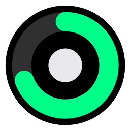
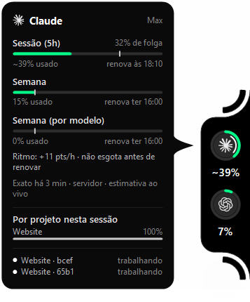
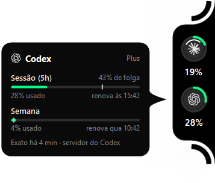
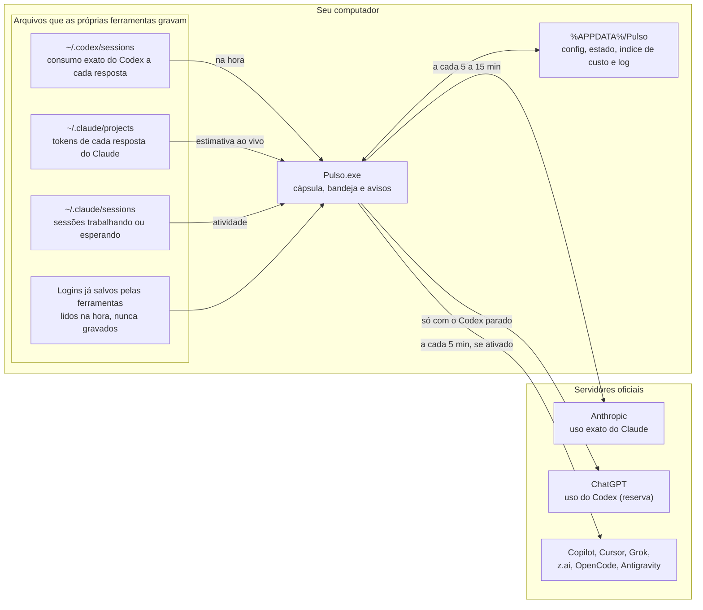
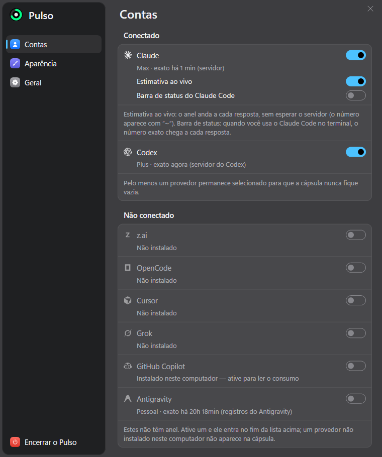
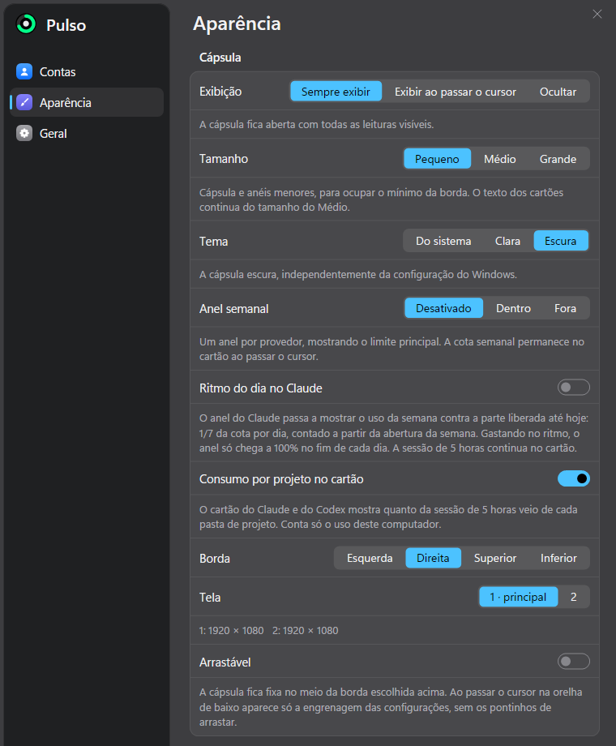
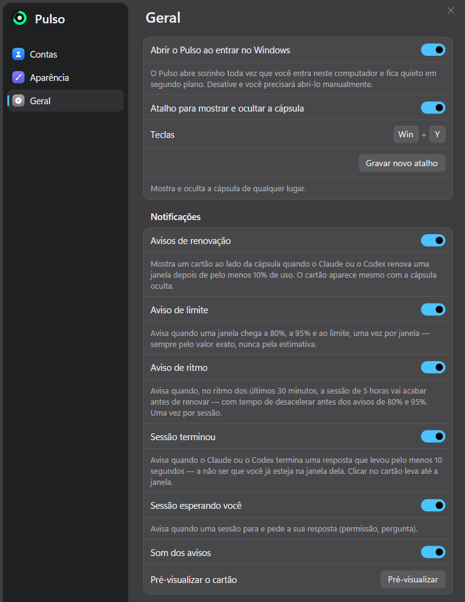

<div align="center">



<h1>Pulso</h1>

<p>
  <strong>O consumo do Claude Code e do Codex ao vivo, numa cápsula na borda da tela do Windows.</strong>
</p>

<p>
  App nativo para Windows que mostra, em anéis sempre à vista, quanto já foi usado de cada limite (sessão de 5 horas, semana, semana por modelo) e quando ele renova. A leitura do Codex chega no instante em que a resposta termina, direto dos arquivos de sessão; a do Claude combina a leitura exata do servidor com uma estimativa local que se move a cada resposta. Leve, sem navegador embutido e sem gravar nenhuma credencial.
</p>

<br/>

<p>
  <a href="https://learn.microsoft.com/dotnet/csharp/"></a>
  
  <a href="https://dotnet.microsoft.com/download/dotnet-framework/net48"></a>
  
  <a href="https://learn.microsoft.com/windows/win32/"></a>
</p>

<br/>

<p>
  
  
  
</p>

<br/>

<table>
  <tr>
    <td align="center"></td>
    <td align="center"></td>
  </tr>
  <tr>
    <td align="center"><sub>Cursor sobre o anel do Claude</sub></td>
    <td align="center"><sub>Cursor sobre o anel do Codex</sub></td>
  </tr>
</table>

</div>

---

## Sumário

- [O que o Pulso faz](#o-que-o-pulso-faz)
- [Provedores suportados](#provedores-suportados)
- [Como a leitura funciona](#como-a-leitura-funciona)
  - [Com que frequência cada leitura acontece](#com-que-frequência-cada-leitura-acontece)
- [Tecnologias](#tecnologias)
- [Privacidade e segurança](#privacidade-e-segurança)
- [Leveza](#leveza)
- [Estrutura do projeto](#estrutura-do-projeto)
- [Instalação](#instalação)
  - [O que a instalação cria](#o-que-a-instalação-cria)
- [Atualização](#atualização)
- [Desinstalação](#desinstalação)
- [Como usar](#como-usar)
- [Configurações](#configurações)
- [Desenvolvimento](#desenvolvimento)
- [Diagnóstico e linha de comando](#diagnóstico-e-linha-de-comando)
- [Autor](#autor)

## O que o Pulso faz

| Recurso | Como funciona |
|---|---|
| **Anéis ao vivo** | Um anel por provedor, encostado na borda da tela, com o percentual do limite principal. A cor passa de verde para amarelo e vermelho nos limites que você escolher. Um `~` antes do número indica que ele já inclui a estimativa local |
| **Cartão ao passar o cursor** | Cada janela de limite com barra, percentual usado, horário de renovação, folga ou excesso em relação ao ritmo (com uma marca na barra), velocidade em pontos por hora, projeção de esgotar antes de renovar, de onde veio a leitura e há quanto tempo |
| **Consumo por projeto** | O cartão do Claude e do Codex mostra quanto da sessão de 5 horas veio de cada pasta de projeto (opcional) |
| **Sessões ativas** | O cartão lista as sessões trabalhando ou esperando você; clicar numa delas traz a janela daquela sessão para a frente |
| **Indicador de atividade** | Dentro do anel: arco girando enquanto o agente trabalha, círculo pulsando quando ele para e espera a sua resposta |
| **Avisos** | Cartão ao lado do anel, com som do Windows, quando um limite renova, quando chega a 80%, 95% e 100%, quando uma sessão termina e quando ela fica esperando você. Clicar no aviso leva à janela da sessão |
| **Aviso de ritmo** | Antes de chegar aos 80%: se no ritmo dos últimos 30 minutos a sessão de 5 horas vai acabar antes de renovar, o Pulso avisa a hora em que ela acaba e quanto tempo antes da renovação (opcional) |
| **Instala como um app** | Fica em Programas, no Menu Iniciar e em Configurações › Aplicativos do Windows, com Desinstalar; atualiza pelo próprio app |
| **Três modos de exibição** | Sempre aberto; recolhido numa cápsula pequena que abre ao passar o cursor (com a opção de a cápsula mudar de cor conforme o fundo); ou oculto, só com o ícone na bandeja |
| **Qualquer borda, qualquer monitor** | Direita, esquerda, superior ou inferior, em qualquer tela. Arrastável pelos pontinhos, pela engrenagem ou com Alt, ou fixo no meio da borda |
| **Some em tela cheia** | Jogo, vídeo ou apresentação em tela cheia escondem a cápsula sozinhos, e ela volta ao sair. Janela maximizada não conta, mesmo com a barra de tarefas em ocultar automaticamente |
| **Atalho global** | `Win + Y` mostra e oculta a cápsula de qualquer lugar; dá para gravar outra combinação |
| **Bandeja do sistema** | Ícone com um mini-anel e um menu com todas as leituras e horários de renovação |
| **Inicia com o Windows** | Abre sozinho ao entrar no Windows e fica quieto em segundo plano |

<div align="center">
  
  <br/>
  <sub>A cápsula em repouso: um anel por provedor, com os arcos nas duas orelhas</sub>
</div>

## Provedores suportados

Claude e Codex vêm ligados. Os outros aparecem na aba **Contas** e só ganham anel quando você os ativa; um provedor que não está instalado no computador não ocupa espaço na cápsula.

| Provedor | De onde vem o número |
|---|---|
| **Claude Code** | Leitura exata do servidor da Anthropic (`/api/oauth/usage`) com o login que o Claude Code já mantém, mais a estimativa ao vivo calculada pelos tokens de cada resposta gravada em `~/.claude/projects` |
| **Codex** | Os arquivos de sessão do próprio Codex (`~/.codex/sessions`), que trazem o consumo exato a cada resposta. O servidor do ChatGPT só é consultado quando o Codex fica parado |
| **GitHub Copilot** | API do GitHub com o login do `gh` (ou `GH_TOKEN`): pedidos premium do mês |
| **Cursor** | Banco local do Cursor (SQLite) para o login e a API de uso do Cursor |
| **Grok** | Login salvo em `~/.grok` e a API de cobrança do Grok |
| **z.ai (GLM)** | Chave da API e o endpoint de cota da z.ai |
| **OpenCode** | Login do OpenCode e a API de uso do opencode.ai |
| **Antigravity** | Servidor local do Antigravity quando ele está aberto, ou o login guardado no Gerenciador de Credenciais do Windows; sem cota publicada, mostra a contagem de pedidos do dia |

## Como a leitura funciona



**A estimativa do Claude.** O servidor da Anthropic aceita poucas consultas (responde `429` se consultado demais). Para o anel não ficar parado entre uma leitura e outra, o Pulso mantém um índice do custo de cada minuto de uso, montado a partir dos tokens gravados nas sessões. Com uma única leitura exata ele calcula quanto cada dólar de uso representa da janela (`% da janela ÷ custo desde o início da janela`) e, a partir daí, soma o custo das respostas novas. O número estimado aparece com `~` e é corrigido a cada leitura exata.

### Com que frequência cada leitura acontece

| Fonte | Quando |
|---|---|
| Codex (arquivos de sessão) | Na hora: 0,1 a 0,2 s depois de a resposta ser gravada |
| Codex (servidor) | Só quando o Codex fica mais de 5 minutos parado |
| Claude, leitura exata | A cada 5 min com o Claude em uso e a cada 15 min parado; nunca menos de 2 min entre consultas; a espera pedida pelo servidor é respeitada e sobrevive a reinício |
| Claude, estimativa | A cada resposta gravada nos arquivos de sessão |
| Atividade das sessões | Na hora, pelo registro que o Claude Code mantém em `~/.claude/sessions` (sem hooks) |
| Outros provedores | Detecção a cada 15 s; consulta a cada 5 min, só se o provedor estiver ativado |
| Clique num anel | Pede uma leitura nova daquele provedor; no Claude, assim que passar o intervalo mínimo de 2 min |

## Tecnologias

O Pulso não usa nenhum pacote externo: tudo vem do próprio Windows e do .NET Framework.

| Tecnologia | Função no projeto |
|---|---|
| **C# 5** | Linguagem, compilada pelo `csc.exe` que já vem com o .NET Framework |
| **.NET Framework 4.8** | Runtime (já instalado no Windows 10 1903+ e no Windows 11) |
| **Windows Forms** | Janelas, ícone da bandeja e menus |
| **GDI+** | Desenho da cápsula, dos anéis, dos cartões e das Configurações |
| **DirectWrite** | Todo o texto da cápsula, dos cartões e das Configurações, desenhado como o Chromium (máscara ClearType de cada letra, modo pela tabela `gasp` da fonte, posição em 1/4 de pixel) e misturado com o fundo como o texto do próprio Windows, com a gamma, o contraste e o ClearType de cada monitor. Nítido em qualquer tamanho e monitor, igual no Windows 10 e no 11 |
| **Win32** | Janela transparente por pixel (`UpdateLayeredWindow`), atalho global (`RegisterHotKey`), gravação do atalho (gancho de teclado), detecção de tela cheia (`SetWinEventHook`) e DPI por monitor |
| **winsqlite3.dll** | SQLite nativo do Windows, para ler os bancos locais do Cursor e do OpenCode |
| **WMI** | Localizar o servidor local do Antigravity |
| **JavaScriptSerializer** | Leitura e escrita de JSON, sem dependência externa |

## Privacidade e segurança

| Ponto | Como o Pulso trata |
|---|---|
| **Credenciais** | Lê só os logins que cada ferramenta já mantém no seu usuário, em memória e na hora da consulta. Nada é gravado, copiado ou enviado para outro lugar além do servidor oficial de cada uma |
| **Token vencido** | Um token do Claude vencido nunca é enviado; o Pulso espera o Claude Code renová-lo |
| **O que fica salvo** | Apenas `%APPDATA%\Pulso`: `config.json` (suas escolhas), `estado.json` (últimas leituras e calibração, só números e datas), `custos.json` (custo por minuto e por projeto do Claude), `codex-projetos.json` (uso por minuto e por projeto do Codex) e `pulso.log` (rotativo, até 512 KB). Nenhuma credencial |
| **Atualização** | A procura usa o próprio Git do computador e o login que ele já tem; o Pulso não guarda senha nem token do GitHub |
| **Sem hooks** | A atividade das sessões vem dos arquivos que o Claude Code já grava; nada é instalado no `settings.json` |
| **Barra de status (opcional)** | Ligada só pelo botão nas Configurações: grava uma linha no `~/.claude/settings.json`, com backup, e desligar remove a linha |
| **Cápsula adaptável** | Lê o brilho médio de uma faixa fina da tela ao lado da cápsula; nada da imagem é guardado |

## Leveza

Medido com o Pulso aberto, o Claude trabalhando e o indicador de atividade animando:

| | Pulso |
|---|---|
| Memória em uso | ~68 MB (44 MB próprios) |
| CPU | ~0,2% |
| Programa no disco | 296 KB |
| Dados salvos | ~0,1 MB |

A cápsula só redesenha quando algo muda: 60 quadros por segundo durante a animação de abrir, 10 por segundo com um agente trabalhando e nenhum quando está tudo parado.

## Estrutura do projeto

```bash
Pulso/
├── src/
│   ├── App.cs                   # Ponto de entrada: instância única, liga fontes, cápsula, bandeja e avisos
│   ├── Core/                    # Regras e infraestrutura
│   │   ├── Config.cs            # Configurações (config.json)
│   │   ├── Model.cs             # Provedor, janela de limite, sessão e o estado compartilhado
│   │   ├── Catalogo.cs          # Os 8 provedores e a página de uso de cada um
│   │   ├── Ritmo.cs             # Folga/excesso em relação ao ritmo e velocidade em pontos por hora
│   │   ├── Avisos.cs            # Quando mostrar cada aviso (renovação, 80/95/100%, ritmo, sessões)
│   │   ├── Projetos.cs          # Uso por minuto e por pasta de projeto (cartão "Por projeto nesta sessão")
│   │   ├── Instalacao.cs        # Instalar, registrar em Aplicativos, atalho, desinstalar e a versão
│   │   ├── Atualizacao.cs       # Procura de versão nova no GitHub e o atualizar.cmd
│   │   ├── Atalhos.cs           # Atalho global e a gravação de uma combinação nova
│   │   ├── Seguidor.cs          # Acompanha arquivos .jsonl que crescem e entrega cada linha nova
│   │   ├── EstadoSalvo.cs       # Últimas leituras e calibração (estado.json)
│   │   ├── Integracao.cs        # Início com o Windows, barra de status e mensagens entre instâncias
│   │   ├── Foco.cs              # Acha e traz para a frente a janela de uma sessão
│   │   ├── Sons.cs              # Sons dos avisos
│   │   ├── Json.cs              # JSON sem dependência externa
│   │   └── Paths.cs             # Caminhos (respeita CLAUDE_CONFIG_DIR e CODEX_HOME) e o log
│   ├── Sources/                 # De onde vêm os números
│   │   ├── ClaudeFonte.cs       # Junta a leitura exata e a estimativa do Claude
│   │   ├── ClaudeServidor.cs    # Consulta ao servidor da Anthropic, com espaçamento e espera
│   │   ├── ClaudeSessoes.cs     # Índice de custo por minuto a partir dos tokens das sessões
│   │   ├── ClaudeRegistro.cs    # Sessões trabalhando, esperando ou paradas
│   │   ├── CodexFonte.cs        # Leitura do Codex e a reserva pelo servidor
│   │   ├── CodexSessoes.cs      # Arquivos de sessão do Codex
│   │   ├── CodexProjetos.cs     # Tokens de cada resposta do Codex por pasta de projeto
│   │   ├── FonteExtra.cs        # Base dos outros provedores (detecção e consulta)
│   │   ├── Extras.cs            # Cria o leitor de cada provedor extra
│   │   ├── OutrosProvedores.cs  # Copilot, Grok, Cursor, z.ai e OpenCode
│   │   ├── Antigravity.cs       # Antigravity
│   │   └── Sqlite.cs            # Acesso ao winsqlite3.dll
│   └── Ui/                      # Tudo o que aparece na tela
│       ├── NotchJanela.cs       # A cápsula: anéis, cartão, animação, arrastar
│       ├── Configuracoes.cs     # Janela de Configurações, desenhada do zero
│       ├── CartaoAviso.cs       # Cartão de aviso ao lado do anel
│       ├── Bandeja.cs           # Ícone e menus da bandeja e do botão direito
│       ├── Glifos.cs            # Logotipos dos provedores em vetor
│       ├── Paleta.cs            # Cores dos temas claro e escuro
│       ├── DWrite.cs, Tx.cs     # Texto pelo DirectWrite
│       ├── TextoGdi.cs          # Texto pelo GDI (reserva)
│       ├── Texto.cs             # Formatação de percentuais, horários e ritmo
│       ├── Superficie.cs        # Bitmap com transparência ligado à janela
│       └── Nativo.cs            # Chamadas ao Win32
├── assets/pulso.ico             # Ícone do app
├── tools/gerar-icone.ps1        # Gera o pulso.ico
├── docs/imagens/                # Imagens deste README
├── app.manifest                 # DPI por monitor e controles visuais do Windows
├── build.cmd                    # Compila o bin\Pulso.exe (e grava o commit da compilação)
├── instalar.cmd                 # Compila e instala (ou reinstala por cima)
└── atualizar.cmd                # Baixa a versão nova do GitHub e reinstala
```

## Instalação

O Pulso roda em qualquer computador com **Windows 10 ou 11** e se instala como um app comum, só para o seu usuário, sem permissão de administrador. Ele não guarda nada da máquina em que foi criado: cada computador mantém as próprias configurações em `%APPDATA%\Pulso`.

### Pré-requisitos

| Item | Versão | Obrigatório? | Download oficial | Observação |
|---|---:|---|---|---|
| **Windows** | `10 (1903+)` ou `11` | Sim | — | Usa recursos do próprio Windows (janela transparente, bandeja, atalho global) |
| **.NET Framework** | `4.8` | Sim | [Baixar .NET Framework 4.8](https://dotnet.microsoft.com/pt-br/download/dotnet-framework/net48) | Já vem no Windows 10 1903+ e no 11. Traz o compilador `csc.exe` que o `build.cmd` usa; não precisa de Visual Studio nem do SDK do .NET |
| **Git** | Atual | Sim | [Baixar Git](https://git-scm.com/downloads) | Para baixar o projeto e receber as atualizações |
| **Claude Code** e/ou **Codex** | Atual | Para ter leituras | [Claude Code](https://claude.com/claude-code) · [Codex](https://developers.openai.com/codex) | Instalados e logados nesse computador: o Pulso lê o que eles gravam |

### Passo a passo

```bat
:: Baixar o projeto (é privado: entre na sua conta do GitHub quando o Git pedir)
git clone https://github.com/LucasDias777/Pulso.git

:: Instalar: compila, instala e já abre o Pulso
Pulso\instalar.cmd
```

Também dá para dar dois cliques no `instalar.cmd` dentro da pasta baixada.

> **Computador com outra conta do GitHub** (como o da empresa): clone com o usuário no endereço, `https://LucasDias777@github.com/LucasDias777/Pulso.git`. Assim o Git guarda o login pessoal separado e não confunde com a outra conta.

> **Mantenha a pasta clonada**: é dela que saem as atualizações. O Pulso instalado fica em outra pasta.

### O que a instalação cria

| Onde | O quê |
|---|---|
| `%LOCALAPPDATA%\Programs\Pulso` | O `Pulso.exe` e o `desinstalar.cmd` |
| Menu Iniciar | Atalho **Pulso** |
| Configurações › Aplicativos do Windows | Entrada **Pulso**, com versão, autor e **Desinstalar** |
| Início com o Windows | Registro do seu usuário apontando para o Pulso instalado (desligável em Configurações › Geral) |
| `%APPDATA%\Pulso` | Configurações e dados, criados conforme o uso |

Rodar o `instalar.cmd` de novo reinstala por cima, mantendo as configurações.

## Atualização

O Pulso procura versão nova sozinho, 2 minutos depois de abrir e a cada 12 horas, comparando a versão instalada com a do GitHub. Quando há uma nova, aparecem:

- em **Configurações › Geral › Atualizações**, o botão **Atualizar agora** (e **Procurar atualização**, para conferir na hora);
- na bandeja e no botão direito da cápsula, **Atualizar o Pulso (versão nova)**.

Atualizar abre uma janela que baixa a versão nova, compila, fecha o Pulso e abre o novo em alguns segundos; as configurações ficam. O mesmo pode ser feito com dois cliques no `atualizar.cmd` da pasta clonada.

Na primeira vez em cada computador, clique em **Procurar atualização**: se o Git ainda não tiver o login do GitHub dessa conta, ele abre a janela de login uma vez e guarda. A procura automática nunca abre janela.

## Desinstalação

Por **Configurações › Aplicativos › Aplicativos instalados › Pulso › Desinstalar**, como qualquer app, ou pelo botão **Desinstalar…** em Configurações › Geral do Pulso. O desinstalador:

1. pede confirmação;
2. fecha o Pulso e remove o início com o Windows, o atalho do Menu Iniciar, a entrada em Aplicativos e a barra de status do Claude Code (se estava ligada);
3. pergunta se apaga também as configurações e o histórico (`%APPDATA%\Pulso`). Responda **Não** para mantê-los e reinstalar depois com tudo igual;
4. apaga a pasta do programa.

A pasta clonada do projeto não é tocada; apague-a à mão se não for reinstalar.

## Como usar

| Ação | Resultado |
|---|---|
| Passar o cursor num anel | Abre o cartão daquele provedor |
| Clicar num anel | Pede uma leitura nova (no Claude, respeitando o intervalo mínimo de 2 min) |
| Clicar numa sessão no cartão | Traz a janela daquela sessão para a frente |
| Passar o cursor na orelha de baixo e clicar na engrenagem | Abre as Configurações |
| Arrastar os pontinhos ou a engrenagem, ou segurar Alt e arrastar a cápsula | Leva a cápsula para outra posição, borda ou monitor (com **Arrastável** ligado) |
| Botão direito na cápsula | Atualizar, abrir a página de uso, manter aberto, mudar de borda, ocultar, Configurações e sair |
| `Win + Y` | Mostra e oculta a cápsula |
| Abrir o Pulso pelo Menu Iniciar com ele já aberto | Abre as Configurações |

## Configurações

<table>
  <tr>
    <td align="center"></td>
    <td align="center"></td>
    <td align="center"></td>
  </tr>
  <tr>
    <td align="center"><sub>Contas</sub></td>
    <td align="center"><sub>Aparência</sub></td>
    <td align="center"><sub>Geral</sub></td>
  </tr>
</table>

| Aba | O que dá para ajustar |
|---|---|
| **Contas** | Quais provedores têm anel (um provedor ativado entra no fim da cápsula), a estimativa ao vivo do Claude e a barra de status do Claude Code. Mostra o plano e a origem da última leitura de cada um |
| **Aparência** | Exibição (sempre, ao passar o cursor ou oculto), cápsula adaptável, tamanho (o Pequeno encolhe só a cápsula e os anéis; o texto dos cartões fica como no Médio), tema, anel semanal (dentro, fora ou tracejado), ritmo do dia no Claude, consumo por projeto no cartão, borda, monitor, arrastável e os limites de cor (atenção e crítico, em degrau ou rampa) |
| **Geral** | Abrir com o Windows, atalho global e gravação de uma combinação nova, cada tipo de aviso (inclusive o de ritmo), som, pré-visualização do cartão de aviso, atualizações, pasta de dados e desinstalar |

## Desenvolvimento

Para testar uma mudança sem instalar, feche antes o Pulso instalado (**Encerrar o Pulso** nas Configurações ou **Sair do Pulso** na bandeja; só um Pulso roda por vez) e rode da pasta do projeto:

```bat
build.cmd
bin\Pulso.exe
```

Para levar a mudança para a versão instalada, rode o `instalar.cmd`. O `build.cmd` grava o commit atual na compilação, e é por ele que a procura de atualização compara a versão instalada com o GitHub.

## Diagnóstico e linha de comando

| Comando | Uso |
|---|---|
| `Pulso.exe` | Abre o Pulso; se ele já estiver rodando, abre as Configurações |
| `Pulso.exe --captura <pasta>` | Salva em PNG a cápsula aberta, o cartão de cada provedor, a cápsula recolhida e as três abas das Configurações, sem mexer no que está na tela |
| `Pulso.exe --bancada <pasta> [1x0.8,1.25x1,…]` | Sem abrir o app, salva em PNG a cápsula e os cartões em cada combinação de escala do monitor × tamanho (padrão: 100/125/150% × Pequeno/Médio/Grande), para conferir o texto em telas que não estão ligadas |
| `Pulso.exe --previa` | Mostra um cartão de aviso de exemplo |
| `Pulso.exe --gravar-teste` | Testa a gravação de um atalho novo e registra o resultado no log |
| `Pulso.exe --statusline` | Usado pela barra de status do Claude Code, quando ligada nas Configurações |
| `Pulso.exe --sair` | Fecha o Pulso aberto e espera ele terminar (usado pelo `instalar.cmd`) |
| `Pulso.exe --registrar <pasta do projeto>` | Cria o atalho, a entrada em Aplicativos e o início com o Windows (usado pelo `instalar.cmd`) |
| `Pulso.exe --desinstalar` | Remove tudo o que a instalação criou (usado pelo `desinstalar.cmd`) |

O log fica em `%APPDATA%\Pulso\pulso.log`, aberto pelo botão **Abrir pasta** em Configurações › Geral.

## Autor

<div align="center">

<h3>Desenvolvido por Lucas Dias.</h3>

<a href="https://github.com/LucasDias777">
  
</a>

</div>
